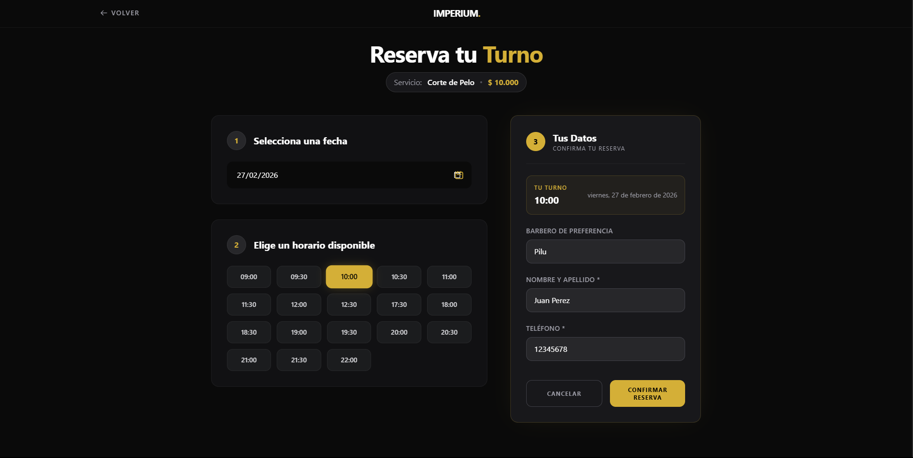
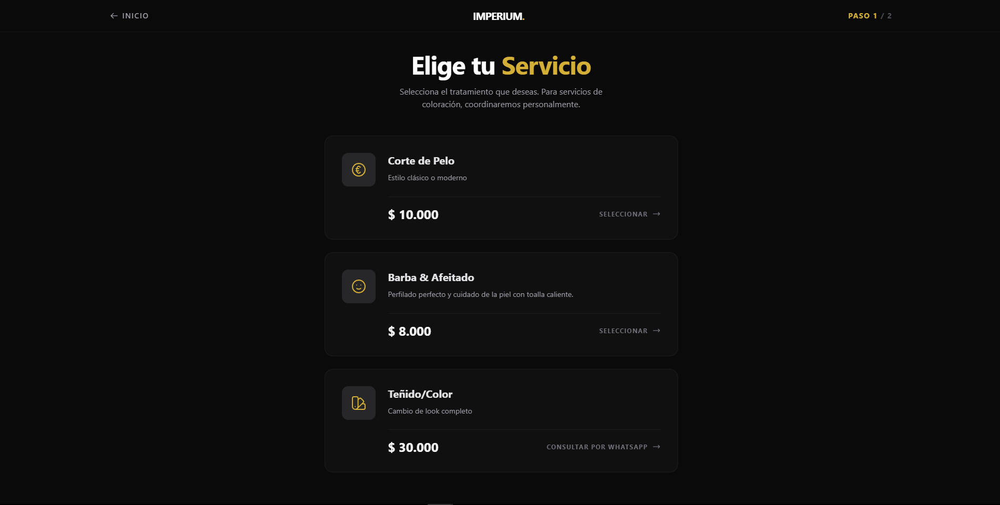
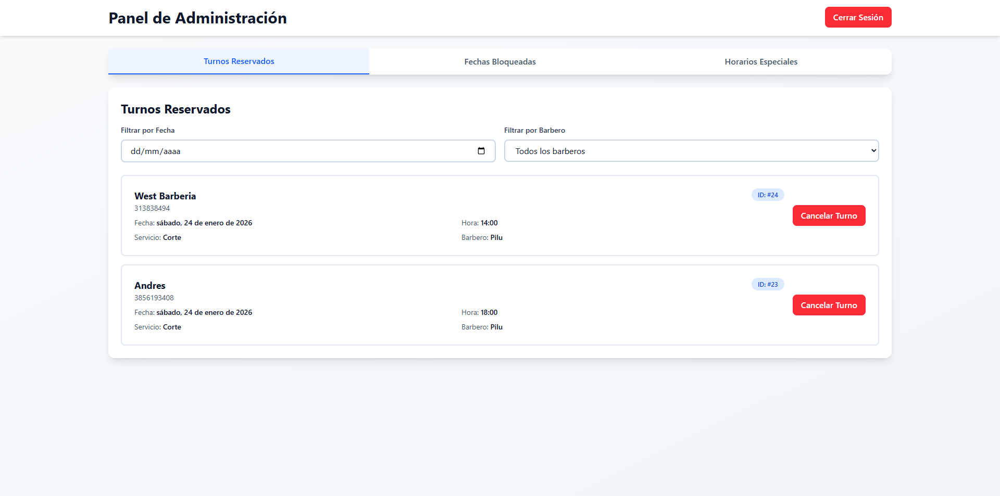

# ✂️ Sistema de Reservas - Gestión de Turnos Profesional

Este proyecto es una solución integral diseñada para automatizar la gestión de turnos y clientes en negocios de servicios (específicamente optimizado para una Barbería). Permite optimizar el tiempo del profesional y mejorar la experiencia de reserva para el usuario final.

---

## 🖼️ Vista Previa del Proyecto

| Calendario de Turnos | Gestión de Servicios | Panel de Administración |
| :---: | :---: | :---: |
|  |  |  |

> **Nota:** No olvides subir tus capturas a la carpeta `/screenshots` con estos nombres.

---

## 🚀 Características Principales

* **Reserva de Turnos Online:** Interfaz intuitiva para que los clientes seleccionen fecha y hora según disponibilidad real.
* **Panel de Administración:** Gestión completa de la agenda, visualización de citas próximas y control de horarios.
* **Catálogo de Servicios:** Módulo para configurar distintos tipos de cortes, tratamientos y sus respectivos precios/duraciones.
* **Validación de Disponibilidad:** Sistema inteligente que evita solapamientos de turnos.
* **Diseño Mobile-First:** Optimizado para que los clientes puedan reservar rápidamente desde su celular.

## 🛠️ Stack Tecnológico

* **Frontend:** React.js / Next.js con Tailwind CSS.
* **Backend:** Node.js para la lógica de negocio y manejo de horarios.
* **Base de Datos:** PostgreSQL / Supabase para el almacenamiento persistente de citas y usuarios.
* **Gestión de Estado:** [Context API / Redux - especificar el que usaste].
* **Despliegue:** Vercel / Netlify.

---

## 📐 Solución Comercial (Freelance Focus)
Este sistema es un ejemplo perfecto de cómo puedo ayudar a negocios locales a digitalizarse:
1.  **Reducción de Ausencias:** Organización clara que permite llevar un control estricto de la agenda.
2.  **Disponibilidad 24/7:** El negocio recibe reservas incluso fuera del horario de atención.
3.  **Personalización:** Estructura flexible que puede adaptarse a peluquerías, centros de estética, consultorios, etc.

---

<details>
  <summary>🛠️ <b>Instrucciones de Instalación (Técnico)</b></summary>

### Configuración local:

1.  **Clonar:**
    ```bash
    git clone [https://github.com/AndressCoronel/Sistema-de-Reservas.git](https://github.com/AndressCoronel/Sistema-de-Reservas.git)
    cd Sistema-de-Reservas
    ```

2.  **Instalar:** `npm install`
3.  **Base de Datos:** Configurar las variables de entorno para la conexión con la DB.
4.  **Ejecutar:** `npm run dev`
</details>

---
Desarrollado por **[Andres Coronel](https://github.com/AndressCoronel)** *Desarrollador Full-Stack enfocado en la digitalización de negocios.*